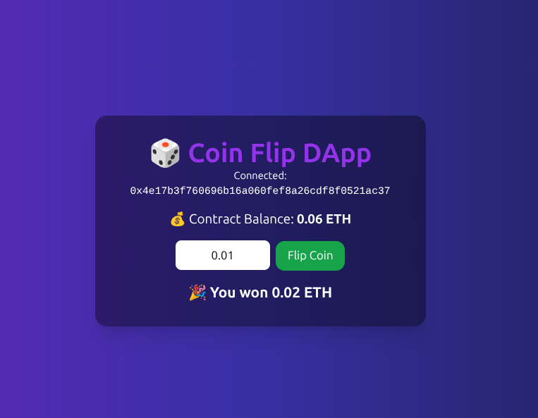

# 🎲 Coin Flip DApp

A decentralized Coin Flip game built with **Solidity**, **React.js**, **Ethers.js**, and **TailwindCSS**.  
Deployed on **Sepolia Testnet** and integrated with **MetaMask**.

---

## 🚀 Features
- Flip a coin by betting ETH.
- Win double your bet if you guess correctly (50/50 chance).
- Secure smart contract deployed on Sepolia.
- Connect your wallet via MetaMask.
- Clean UI built with React + TailwindCSS.

---

## 📸 Screenshots
### DApp Interface


---

## 🛠️ Installation & Setup

1. Clone the repository:
   ```bash
   git clone https://github.com/HemeshKanyal/coinflip-dapp.git
   cd coinflip-dapp
2. Install dependencies:
    npm install
3. Start the development server:
    npm start
The app will be available at http://localhost:3000

📜 Smart Contract

Contract: contracts/CoinFlip.sol
Network: Sepolia Testnet
Example deployed address: 0x9d2C68fa1199B8B720e59B4E18264C81cCacDafA
Verify transactions: Sepolia Etherscan

🔗 Connecting MetaMask
Open MetaMask.
Add Sepolia Test Network (if not already available).
Fund your wallet with Sepolia ETH from a faucet
Connect wallet in the DApp and start flipping!

🧑‍💻 Technologies Used
Solidity
Hardhat / Remix (for deployment)
React.js (Frontend)
Ethers.js (Blockchain interaction)
TailwindCSS (Styling)

📄 License
This project is licensed under the MIT License.
Feel free to use, modify, and share!